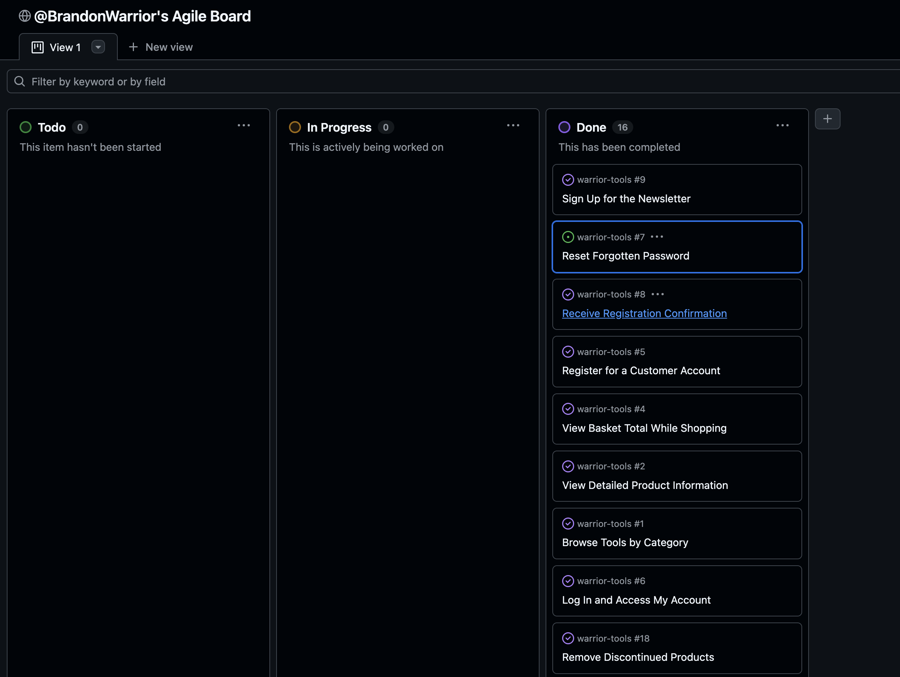

🔙 [Back to README.md](README.md)

# Warrior Tools – Project Planning

## 🔍 Overview

**Warrior Tools** is an e-commerce web application designed for power tool enthusiasts, tradespeople, and DIYers. The platform allows users to browse, search, and purchase high-quality power tools. The goal of this application is to provide a fast, secure, and modern shopping experience with features such as account registration, product filtering, newsletter subscriptions, and an easy-to-use admin interface for managing products.

The application is being developed using the Django web framework and will include Stripe integration for secure payments, a relational database (initially SQLite, then PostgreSQL in production), and be fully deployed to a cloud hosting platform - Heroku

---

## 🎯 Objectives

- Build a fully functional, cloud-hosted Django e-commerce site
- Include full CRUD functionality for products
- Implement user registration, login, and email confirmation
- Create a responsive, UX-friendly interface using HTML/CSS/JS
- Integrate Stripe for secure checkout
- Add marketing features like a newsletter signup and social media links
- Follow SEO and accessibility best practices
- Manage the project using Agile principles and GitHub Projects

---

## 🖼️ Wireframes

Wireframes were created using Balsamiq to visualise the structure and layout of key pages on the Warrior Tools website. These helped guide the site’s design, user flow, and feature planning.

### 🏠 Home Page  

### 🛒 Product Listings  

### 📦 Shopping Bag  

### 💳 Checkout  

### 👤 User Profile  

### 💌 Newsletter  

### 📝 Testimonials  

### 🔎 Summary
Each wireframe served as a visual blueprint for core templates during development:

The home page wireframe prioritised branding and a strong welcome message.

Bag and checkout flows were mapped to minimise user friction and maintain clarity.

Product-related pages focused on visual hierarchy and clean filtering.

Profile and testimonial views were designed to enhance personalisation and engagement.

The newsletter signup was given prominent space as part of the site’s marketing strategy.
---
## 📋 User Stories (Grouped by Epics)

### 🏷 Epic: Browsing and Shopping

- **Browse Tools by Category**  
  As a shopper, I want to browse power tools by category, so that I can easily find the right tools for my needs.

- **View Detailed Product Information**  
  As a shopper, I want to view detailed product information, so that I can decide whether it suits my requirements.

- **See Current Deals and Offers**  
  As a shopper, I want to see current deals and special offers, so that I can take advantage of any savings.

- **View Basket Total While Shopping**  
  As a shopper, I want to see the running total of my shopping basket, so that I can stay within my budget.

- **Search for Products**  
  As a shopper, I want to search for products by name or model, so that I can find specific tools quickly.

- **Filter Products by Criteria**  
  As a shopper, I want to filter results by brand, price, or rating, so that I can find the best tools for my needs.

---

#### 🏷 Epic: User Accounts
- Register for a Customer Account  
- Log In and Access My Account  
- Reset Forgotten Password  
- Receive Registration Confirmation  

#### 🏷 Epic: Newsletter and Marketing
- Sign Up for the Newsletter  

#### 🏷 Epic: Checkout
- Select Product Quantity and Options  
- Enter Secure Payment Details  
- Receive Order Confirmation Email  

#### 🏷 Epic: Admin Product Management
- Add New Products as Admin  
- Edit Existing Product Listings  
- Remove Discontinued Products  

---

## 📋 Agile Workflow

Development for the Warrior Tools project followed Agile methodologies using GitHub Projects to organise, track, and prioritise tasks efficiently.

A dedicated Kanban board was created with three columns: **To Do**, **In Progress**, and **Done**. Each user story or feature was represented as a task card and moved through the workflow as progress was made.

Below are screenshots of the final board showing all completed tasks:

### 🧾 Agile Board Screenshots

| View | Screenshot |
|------|------------|
| Agile Board – Part 1 |  |
| Agile Board – Part 2 |  |

### ✅ Completed User Stories

All cards were moved to **Done**, demonstrating that every planned feature and functionality was implemented successfully. This included:

- Browse Tools by Category  
- View Detailed Product Information  
- View Basket Total While Shopping  
- Search for Products  
- Filter Products by Criteria  
- Select Product Quantity and Options  
- Enter Secure Payment Details  
- Receive Order Confirmation Email  
- Register for a Customer Account  
- Log In and Access My Account  
- Reset Forgotten Password  
- Receive Registration Confirmation  
- Sign Up for the Newsletter  
- Add New Products as Admin  
- Edit Existing Product Listings  
- Remove Discontinued Products  

This structured and iterative approach ensured that development stayed focused and transparent throughout the project lifecycle.

---

🔄 Changes from Original Plan
Now that development is complete, here’s a brief review of where the implementation diverged from the original plan and why:

| Planned Feature                                | Change                                                | Reason                                                                              |
| ---------------------------------------------- | ----------------------------------------------------- | ----------------------------------------------------------------------------------- |
| **Power Tools only**                           | Broadened to include both power and hand tools        | To offer a more realistic inventory and enhance user value                          |
| **SQLite for local dev only**                  | PostgreSQL used in production via Heroku              | Required for cloud deployment and scalability                                       |
| **Basic static newsletter form**               | Implemented model-backed form with email confirmation | To support subscription management and GDPR compliance                              |
| **Manual product sizes**                       | Introduced `has_sizes` and `variant_type` logic       | Provided greater control over which products offer selectable variants like voltage |
| **Simple success message on testimonial form** | Built a full moderation system                        | To allow admin control over published content                                       |
| **No wishlist in MVP**                         | Added wishlist functionality with add/remove buttons  | Boosted user engagement and repeat visits                                           |
| **No email verification**                      | Added verification flow during signup                 | Improved security and trustworthiness of user accounts                              |
