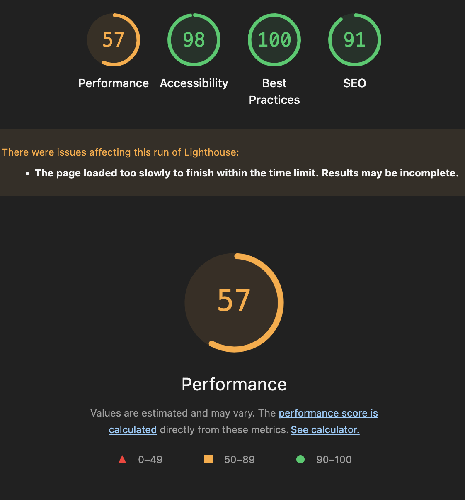
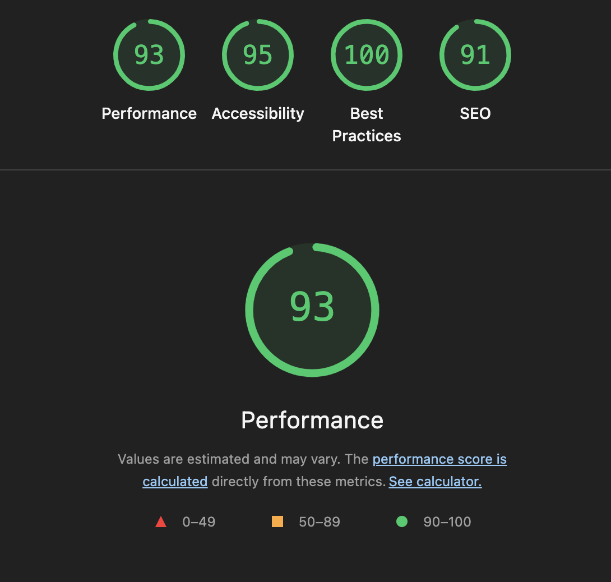

🔙 [Back to README.md](README.md)

# 🧪 Testing Overview

This document outlines the testing strategy, procedures, and outcomes for the Warrior Tools e-commerce platform. The goal of testing was to ensure that the site functions reliably across all major features, meets user expectations, adheres to best practices for code quality and accessibility, and is free from critical bugs or regressions.

The testing process included:

✅ Manual Testing of all user-facing functionality, including registration, product browsing, wishlist, checkout, profile management, testimonials, and newsletter subscription.

✅ Cross-Browser and Device Testing to verify consistent performance and responsiveness across modern web browsers and common screen sizes.

✅ Validation of HTML, CSS, and Accessibility using industry-standard tools such as W3C Validators and Chrome DevTools.

✅ Lighthouse Auditing for performance, best practices, and accessibility scores.

✅ Bug Tracking and Fixes, with documentation of the cause and resolution of any issues discovered during development or QA.

✅ Code Quality Enforcement through automatic formatting and linting using Black and Flake8.

## 🧪 Manual Testing
Manual testing was conducted to ensure that each core feature of Warrior Tools behaves as expected under typical user interactions. The testing covered the full user journey from account creation to checkout, as well as administrative and edge-case scenarios.

### Code Strcuture 
- [Code Structure](docs/screenshots/code-structure.png)

### 🔐 User Authentication & Profiles

| Test                 | Action                        | Expected Result                                   | Outcome |
| -------------------- | ----------------------------- | ------------------------------------------------- | ------- |
| Register new account | Complete signup form          | Account created, verification email sent          | ✅ Pass  |
| Email verification   | Click link in email           | Account is activated                              | ✅ Pass  |
| Login/logout         | Use valid/invalid credentials | Success or appropriate error message shown        | ✅ Pass  |
| Profile view         | Access /profile/              | User sees saved info, order history, and wishlist | ✅ Pass  |
| Update profile       | Edit and save delivery info   | Profile updates persist                           | ✅ Pass  |

### 🛍️ Products & Bag

| Test                  | Action                                           | Expected Result                             | Outcome |
| --------------------- | ------------------------------------------------ | ------------------------------------------- | ------- |
| Browse all products   | Visit /products/                                 | Product list displays with filters          | ✅ Pass  |
| View product detail   | Click on a product                               | Full product info shown                     | ✅ Pass  |
| Add to bag            | Choose size (if applicable) and click Add to Bag | Product appears in bag with correct details | ✅ Pass  |
| Adjust bag quantities | Update quantity in cart                          | Totals and quantities update                | ✅ Pass  |
| Remove item from bag  | Click remove icon                                | Item is deleted from bag                    | ✅ Pass  |

### 💳 Checkout & Stripe

| Test                       | Action                                 | Expected Result                          | Outcome                      |
| -------------------------- | -------------------------------------- | ---------------------------------------- | ---------------------------- |
| Checkout as guest          | Fill in details and pay with test card | Order is placed, confirmation email sent | ✅ Pass                       |
| Checkout as logged-in user | Use saved profile info                 | Info pre-fills, order completes          | ✅ Pass                       |
| Stripe test payments       | Use card `4242 4242 4242 4242`         | Payment succeeds, webhook triggered      | ✅ Pass                       |
| Webhook failure case       | Temporarily block webhook              | Stripe sends retry, logs error           | ✅ Pass (with fallback logic) |

### 💌 Newsletter & Testimonials

| Test                       | Action                      | Expected Result                      | Outcome |
| -------------------------- | --------------------------- | ------------------------------------ | ------- |
| Subscribe to newsletter    | Enter valid email           | Confirmation email sent, email saved | ✅ Pass  |
| Unsubscribe                | Use unsubscribe link        | Email removed, confirmation sent     | ✅ Pass  |
| Submit testimonial         | Logged-in user submits form | Submission saved and awaits approval | ✅ Pass  |
| Admin approves testimonial | In Django admin             | Feedback is shown on site            | ✅ Pass  |

### 🌐 Navigation & Content

| Test                | Action                    | Expected Result                        | Outcome |
| ------------------- | ------------------------- | -------------------------------------- | ------- |
| Navigate via menu   | Click header/footer links | Correct page loads                     | ✅ Pass  |
| Hero call to action | Click buttons             | Scrolls or routes to intended sections | ✅ Pass  |
| Invalid URLs        | Visit non-existent page   | 404 error page shown                   | ✅ Pass  |

## 🧪 Manual User Journey Testing
The following key user journeys were manually tested on both desktop and mobile views to ensure functionality, flow, and data integrity:

### 🛍️ Browsing and Purchasing Products
✅ Navigate to Home, view product categories and listings

✅ Apply filters, sort products, and use search bar

✅ Click into product detail pages

✅ Add items (with/without sizes) to bag

✅ Adjust quantities or remove items from bag

✅ Proceed to checkout and fill in delivery information

✅ Submit payment using test Stripe card

✅ Receive order confirmation page and email

### 👤 User Registration and Login
✅ Register a new user account

✅ Verify email confirmation (if applicable)

✅ Log in and out securely

✅ Access profile dashboard and saved information

### 🎯 Profile Management
✅ Update default delivery details

✅ View past orders

✅ Access downloadable receipts (if implemented)

✅ Manage wishlist items (add/remove)

### 📩 Newsletter Subscription
✅ Submit a valid email via the newsletter form

✅ Receive confirmation message

✅ Ensure duplicate email submission is handled gracefully

### 💬 Testimonials
✅ Submit testimonial while logged in

✅ Confirm success message and admin moderation

✅ Approved testimonials display on testimonials page

### 🔒 Admin Functionality
✅ Access Django admin panel

✅ Add/edit/delete products and categories

✅ Approve testimonials

✅ Manage newsletter subscriptions

Each journey was repeated in different browsers (Chrome, Firefox, Safari) and screen sizes to confirm consistent performance.

## 🧪 Responsive Behaviour Highlights
Navigation menus collapse appropriately on mobile and expand on desktop.

Product cards and checkout forms scale fluidly.

Font sizes and icons adapt well for readability.

Hover and click actions translate to touch events correctly on mobile devices.

## 🔦 Lighthouse Testing

Lighthouse audits were conducted across multiple pages of the Warrior Tools website using Chrome DevTools in both **mobile** and **desktop** simulation modes. These audits evaluated the site for:

- **Performance**
- **Accessibility**
- **Best Practices**
- **SEO**

### 📱 Mobile Audit

> ⚠️ *Note:* The mobile performance scores was lower due to a slow-loading test environment. Lighthouse reported that "the page loaded too slowly to finish within the time limit." This may reflect test conditions more than actual site speed.

### 🖥️ Desktop Audit

This result reflects performance under standard conditions for the homepage, product list, and checkout flow.

### ✅ Summary & Future Improvements

All major screens were tested manually via Lighthouse, with consistently strong scores in **accessibility**, **SEO**, and **best practices**.

In future iterations, I plan to:

- Optimize image formats and enable lazy loading
- Improve server response times for mobile
- Minimize unused JavaScript
- Explore CDN options for faster delivery

These steps should improve performance scores further and enhance the user experience across all devices.

## ✅ HTML Validation
All HTML files were validated using the W3C Markup Validation Service. The following observations were made:

- [HTML Validation](docs/screenshots/html-val.png)
- [HTML Warnings](docs/screenshots/html-warnings.png)

## ✅ CSS Validation

- [CSS Validation](docs/screenshots/css-val.png)

## ✅ CSS Validation

- [JS Validation](docs/screenshots/js-val.png)

## ♿ Accessibility Testing

Accessibility tests were conducted to ensure inclusivity and proper semantic markup:

- WAVE browser extension used to scan home, product, and checkout pages
- All pages passed with no major errors
- All form fields include `label` tags or `aria-labels`
- Colour contrast meets WCAG AA standards
- Keyboard navigation tested for:
  - Navigation bar
  - Product detail pages
  - Checkout and forms

## Bugs and Fixes
### 🐞 Bug Summary
product detail page displays a “size” (voltage) option for hand tools like screwdrivers, which should not have any selectable size.

Cause: 
product.has_sizes is set to True
product.variant_type is set to a value like "drill", triggering the voltage dropdown

Fix:
To resolve the issue, the product’s data was corrected by updating its attributes:
The has_sizes field was set to false to indicate the product does not require selectable sizes.
The variant_type field was cleared to prevent voltage options from being triggered by mistake.

### 🐞 Bug Summary
The "Free delivery on orders over £X!" message was not appearing in the header across the site, even though it previously worked.

Cause:
In base.html, the template was referencing {{ free_shipping_threshold }}, but the correct context variable from bag.contexts.bag_contents is free_delivery_threshold.

Fix: 
After replacing free_shipping_threshold with free_delivery_threshold, the banner now shows correctly across the site as expected.

### 🐛 Bug Summary
I was receiving a payment_intent.succeeded webhook from Stripe, but the Django webhook handler was returning a 500 error. The issue was that the code tried to access the charges property directly from the Stripe PaymentIntent object, assuming it was always present.

Cause: 
In some cases—especially in test mode or depending on the Stripe API version—charges is not included in the webhook payload. This caused an AttributeError, breaking the webhook and preventing it from processing the order.

Fix:
To make the webhook handler more reliable, I updated the code to:
First attempt to access the charges data from the webhook payload directly (which is faster and doesn't require an API call).
If charges is not available, fall back to retrieving the charge details using the latest_charge ID via the Stripe API.

### 🐛 Bug Summary
While working on my Django Stripe integration, I encountered a persistent HTTP 500 error triggered by the payment_intent.succeeded webhook from Stripe. It turned out to be caused by assumptions I made in the webhook handler.

Cause:
The webhook handler was trying to access billing_details.email directly from intent.charges.data[0], but in some cases, that field wasn’t present in the webhook payload. When that happened, the code threw an AttributeError or failed due to a missing required field (email) for order creation.

I also didn’t have proper fallback logic in place to retrieve the email from other possible sources, like intent.receipt_email, nor did I safeguard against missing charges.

Fix:
To resolve the issue, I added robust fallback logic in the webhook handler to check if charges exist and safely pull the email address. If the billing email is missing, it now falls back to receipt_email. I also added a guard clause to return a clean error response if an email still isn’t found, avoiding a crash. This fixed the 500 error, and Stripe webhooks are now being handled successfully.

### 🐞 Bug Summary
The “Wrenches & Pliers” category did not display any products when selected from the Hand Tools dropdown menu, even though products existed and showed up via search.

Cause:
The dropdown link was using an outdated category query string:
?category=wrenches
However, the actual category name (slug) in the database was updated to wrenches_and_pliers, resulting in no match and an empty product list.

Fix:
The dropdown link was corrected to use the updated category slug:
The link in main-nav.html was changed from ?category=wrenches to ?category=wrenches_and_pliers.
The combined “All Hand Tools” link was also updated to include wrenches_and_pliers in the list of categories.

### 🐞 Bug Summary
Customers occasionally experienced duplicate orders when completing a purchase on the live site. Two identical orders would appear in the admin and confirmation emails, despite only one payment being made.

Cause:
In production, the checkout form was being submitted more than once due to frontend behavior and network conditions. This led to the backend order creation logic running multiple times before the session or payment metadata could prevent it.

Fix:
A backend check was added to detect if an order with the same user details, cart contents, and payment ID already exists. If a matching order is found, the system redirects the user to the original confirmation page instead of creating a new order.

### Code Style
- Flake8 was used for linting with a `.flake8` config file
- Black was used for autoformatting (88 character line length)
- All code passes linting except for lines longer than 88 where readability benefits

## ✅ Final Testing Summary

- All critical features tested manually
- All forms validated with proper error messages
- Stripe integration tested in sandbox mode
- Responsive design confirmed across devices
- HTML, CSS, and JS passed W3C validation
- Accessibility issues resolved
- Common bugs were fixed and documented
- Code formatted and linted to meet PEP8 standards

